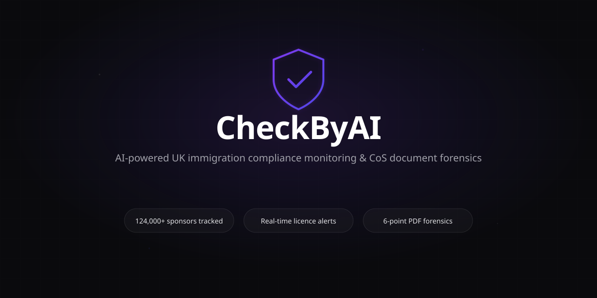
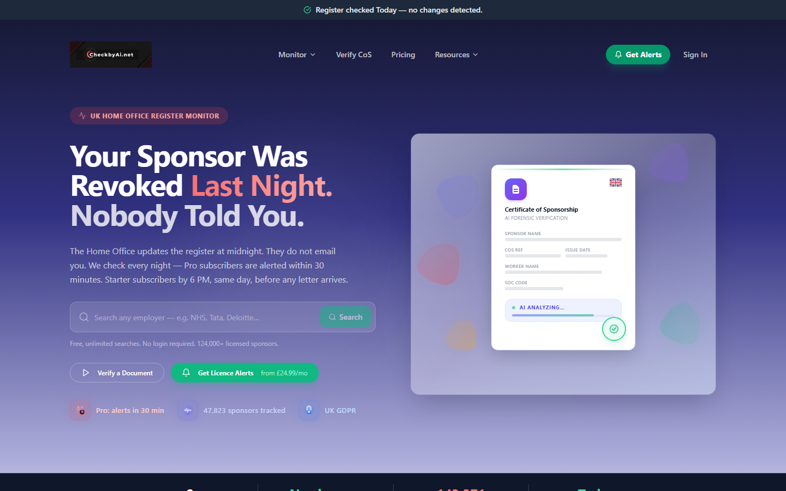
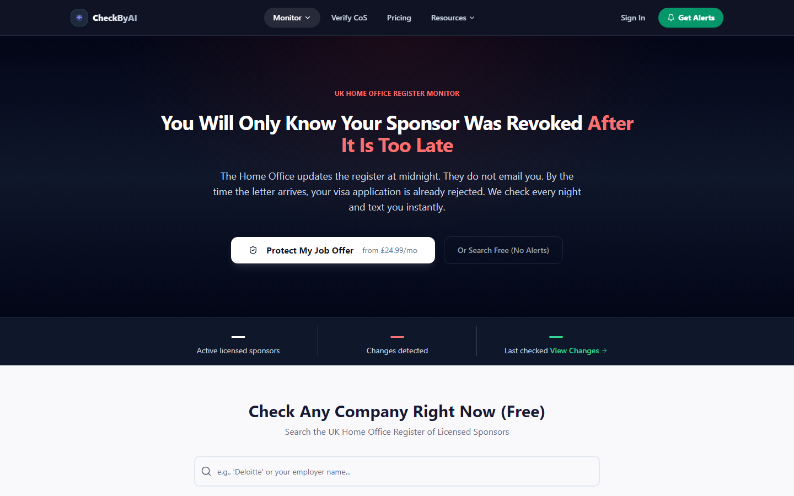
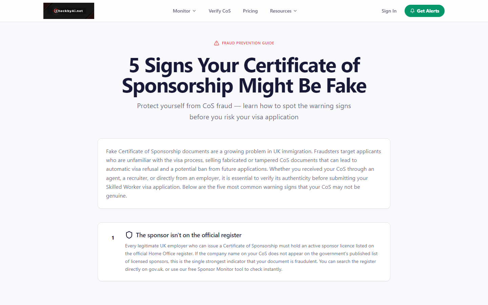
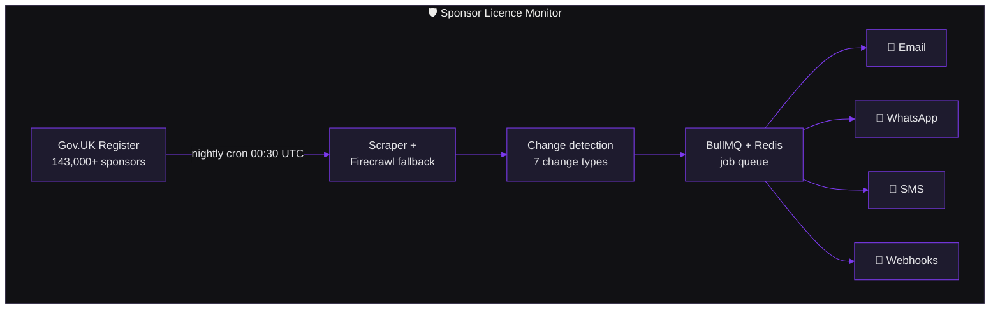
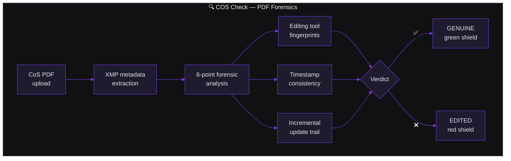

<div align="center">
  <a href="https://checkbyai.net/">
    
  </a>
</div>

# CheckByAI

> **AI-powered UK immigration compliance monitoring & document verification**

[](LICENSE)
[](https://sonarcloud.io/summary/new_code?id=Sam-Aitech_Checkbyai.net)
[](https://www.typescriptlang.org/)
[](https://nodejs.org/)
[](https://www.postgresql.org/)
[](https://github.com/Sam-Aitech/Checkbyai.net/issues)
[](https://github.com/Sam-Aitech/Checkbyai.net/stargazers)

CheckByAI is a comprehensive SaaS platform for UK immigration professionals, HR teams, and visa holders. It provides real-time monitoring of the UK Home Office Register of Licensed Sponsors and forensic verification of Certificates of Sponsorship (COS) documents.

<div align="center">
  <a href="https://checkbyai.net/">
    
  </a>
  <br />
  <sub><em>🌐 Live at <a href="https://checkbyai.net/">checkbyai.net</a></em></sub>
</div>

## 🎯 What We Do

### 1. **Sponsor Licence Monitor**
Automated monitoring of the [UK Home Office Register of Licensed Sponsors](https://www.gov.uk/government/publications/register-of-licensed-sponsors-workers). Instantly alerts you when:
- Sponsors are removed or downgraded
- New routes are added
- Company details change
- Licence status is upgraded

**Perfect for:** Visa holders, immigration advisers, HR compliance teams

<div align="center">
  <a href="https://checkbyai.net/sponsor-monitor">
    
  </a>
  <br />
  <sub><em>Live sponsor monitor — the Home Office updates the register at midnight; CheckByAI texts you instantly.</em></sub>
</div>

### 2. **COS Check — PDF Metadata Inspector (MIS)**
Forensic analysis of Certificate of Sponsorship PDFs using AI and metadata forensics. Detects:
- Document tampering (Photoshop, GIMP, Canva edits)
- Fabricated metadata (missing or reordered XMP fields)
- Suspicious modification dates and metadata inconsistencies
- Incremental updates and editing tool fingerprints
- Invalid certificate generation (non-Apache)

**Two-tier verification:**
- **User View** — Verdict only: GENUINE (green shield) or EDITED (red shield) with one-line reason
- **Admin View** — Full forensics: all 6 authenticity checks.

**Perfect for:** Anyone verifying a COS document authenticity

<div align="center">
  <a href="https://checkbyai.net/check-fake-cos">
    
  </a>
  <br />
  <sub><em>Free fraud-prevention guide: <a href="https://checkbyai.net/check-fake-cos">5 signs your CoS might be fake</a>.</em></sub>
</div>

---

## 🔬 How It Works





---

## ✨ Key Features

| Feature | Free | Starter | Pro | Unlimited | Enterprise |
|---------|------|---------|-----|-----------|------------|
| **Sponsor Watches** | 1 | 2 | 5 | Unlimited | Unlimited |
| **Notifications** | Daily digest (next-morning email) | Email + WhatsApp (6pm) | All channels + Immediate | All channels + Immediate | All channels + Webhooks |
| **Job Alerts** | — | — | ✅ | ✅ | ✅ |
| **Companies House Data** | — | — | ✅ | ✅ | ✅ |
| **COS Check Verifications** | Limited | Limited | Pay-per-check | Unlimited | Unlimited |
| **COS Check MIS** | — | — | ✅ | ✅ | ✅ |
| **API Access** | — | — | — | ✅ | ✅ |
| **Expert Review** | — | — | Optional | Optional | Included |

---

## 🚀 Quick Start

### Prerequisites
- **Node.js** 20+
- **PostgreSQL** 14+ (or [Neon](https://neon.tech/) serverless)
- **Redis** (Highly recommended, used for BullMQ job queue and rate limiting)
- **Firecrawl API Key** (Optional, used as primary scraper fallback for Gov.UK source)
- **npm** or **pnpm**

### Local Development

1. **Clone & install:**
   ```bash
   git clone https://github.com/Sam-Aitech/Checkbyai.net.git
   cd Checkbyai.net
   npm install
   ```

2. **Set up environment:**
   ```bash
   cp .env.example .env
   # Edit .env with your database URL and API keys
   ```

3. **Initialize database:**
   ```bash
   npm run db:push
   npm run db:migrate
   ```

4. **Start development server:**
   ```bash
   npm run dev
   # App: http://localhost:5000
   ```

5. **Run tests:**
   ```bash
   npm run test:run
   ```

See [DEVELOPMENT.md](DEVELOPMENT.md) for detailed setup instructions.

---

## 📋 Documentation

- **[README.md](README.md)** ← You are here
- **[DEVELOPMENT.md](DEVELOPMENT.md)** — Local setup, architecture, running tests
- **[DEPLOYMENT.md](DEPLOYMENT.md)** — Production deployment, environment variables, scaling
- **[CONTRIBUTING.md](CONTRIBUTING.md)** — Development workflow, PR standards, code style
- **[SECURITY.md](SECURITY.md)** — Threat model, authentication, data protection
- **[docs/API_REFERENCE.md](docs/API_REFERENCE.md)** — All API endpoints, schemas, examples
- **[docs/SYSTEM_DESIGN.md](docs/SYSTEM_DESIGN.md)** — Architecture deep-dive, component design

---

## 🏗️ Tech Stack

**Frontend:**
- React 18 + TypeScript
- TailwindCSS + Radix UI
- React Query + Wouter
- Three.js for 3D visualizations

**Backend:**
- Node.js + Express
- TypeScript
- Drizzle ORM
- PostgreSQL (Neon serverless)
- BullMQ + Redis for job queue
- Passport.js (OAuth + Email OTP)

**External Services:**
- **Stripe** — Payment processing
- **Cloudflare Turnstile** — CAPTCHA/bot protection
- **Resend / Brevo** — Email delivery
- **Twilio** — SMS/WhatsApp notifications
- **Cloudflare** — CDN & DDoS protection

---

## 🔐 Security

CheckByAI handles sensitive immigration data. Key security features:

- **End-to-end encryption** for phone numbers (AES-256-GCM)
- **Email OTP authentication** (no passwords)
- **Rate limiting** on all public endpoints
- **CSRF protection** with SameSite cookies
- **SQL injection prevention** via parameterized queries (Drizzle ORM)
- **File upload isolation** with temporary storage + immediate deletion
- **Session management** backed by PostgreSQL

See [SECURITY.md](SECURITY.md) for full threat model, compliance information, and reporting security issues.

---

## 🐛 Reporting Issues

### Security Vulnerabilities
Please email **security@checkbyai.net** with:
- Description of the vulnerability
- Steps to reproduce
- Potential impact

We'll acknowledge receipt within 24 hours and provide updates as we investigate.

### Bugs & Features
Open an issue on [GitHub Issues](https://github.com/Sam-Aitech/Checkbyai.net/issues) with:
- Clear title and description
- Steps to reproduce (for bugs)
- Expected vs. actual behavior
- Screenshots/logs if applicable

---

## 🤝 Contributing

We welcome contributions! See [CONTRIBUTING.md](CONTRIBUTING.md) for:
- Development workflow
- How to set up your environment
- PR standards and code review process
- Commit message conventions

---

## 📊 Metrics & Monitoring

- **Sponsor Register** — 124,000+ UK sponsors tracked
- **Daily cron** — Updates every weekday at 00:30 UTC
- **Change detection** — 7 change types (removals, upgrades, downgrades, etc.)
- **Response time** — Alerts within seconds for paid tiers

---

## 📄 License

CheckByAI is licensed under the [MIT License](LICENSE).

---

## 📞 Support

- **Documentation:** [github.com/Sam-Aitech/Checkbyai.net](https://github.com/Sam-Aitech/Checkbyai.net#readme)
- **Issues:** [GitHub Issues](https://github.com/Sam-Aitech/Checkbyai.net/issues)
- **Discussions:** [GitHub Discussions](https://github.com/Sam-Aitech/Checkbyai.net/discussions)
- **Email:** support@checkbyai.net

---

## 🗺️ Roadmap

Public feature roadmap:

- [GitHub Issues](https://github.com/Sam-Aitech/Checkbyai.net/issues?q=is%3Aopen+label%3Aenhancement)

Operational execution roadmap (enterprise hardening, Phase 0 to Phase 8):

- [docs/EXECUTION_PHASES_0_8.md](docs/EXECUTION_PHASES_0_8.md)

Usage:

1. Feature roadmap explains what users will get.
2. Operational roadmap explains how we make the platform enterprise-ready.

---

**Made with ❤️ by the CheckByAI team**
