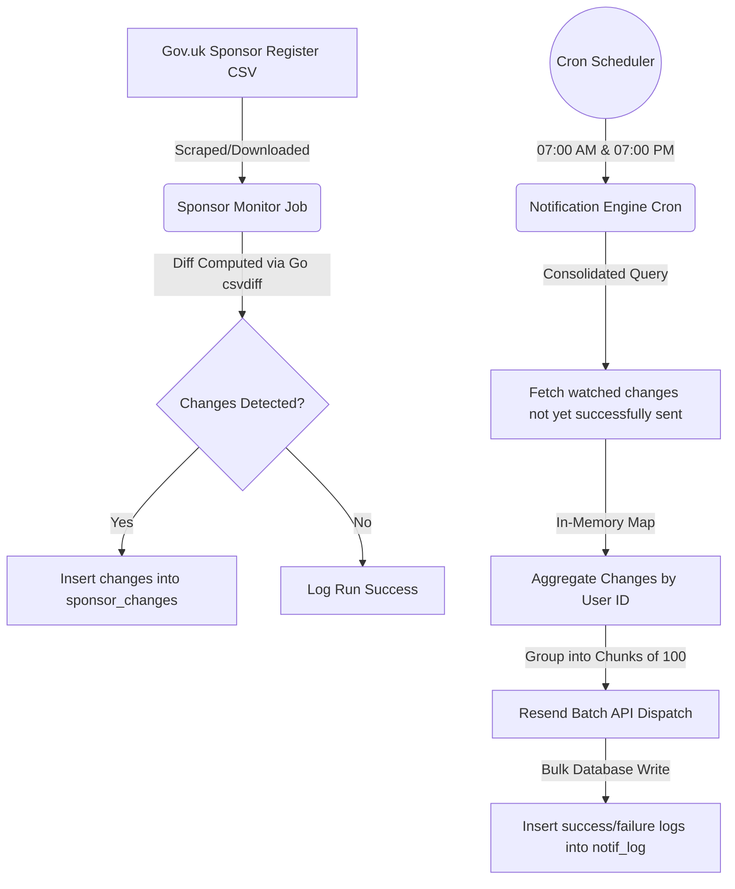

# Design Document: Daily Sponsor License Notification Engine

**Author:** CTO & Lead Architect
**Date:** 2026-06-23
**Status:** Approved by User

---

## 1. Goal Description

This design transitions the notification engine from a real-time, company-centric dispatch model to a high-performance, user-centric daily consolidated update model. 

Subscribers on paid tiers will receive scheduled updates in their inbox twice a day (Early Morning and Evening) containing all status changes for the companies they watch. This eliminates database locking issues, reduces network round-trips to email API providers, prevents user-facing spam, and significantly lowers database query and write overhead.

---

## 2. Architecture & Data Flow



---

## 3. Database Query & Self-Healing Logic

We perform a single join query joining [companyWatches](file:///c:/Users/saumi/Desktop/Sam/AntiGravity/Checkbyai%20-%20Github/Checkbyai.net/shared/schema.ts#L340), [sponsorChanges](file:///c:/Users/saumi/Desktop/Sam/AntiGravity/Checkbyai%20-%20Github/Checkbyai.net/shared/schema.ts#L362), [users](file:///c:/Users/saumi/Desktop/Sam/AntiGravity/Checkbyai%20-%20Github/Checkbyai.net/shared/schema.ts#L63), and [notifLog](file:///c:/Users/saumi/Desktop/Sam/AntiGravity/Checkbyai%20-%20Github/Checkbyai.net/shared/schema.ts#L452).

### The Consolidated Query
```typescript
const pendingNotifications = await db
  .select({
    userId: users.id,
    email: users.email,
    subscriptionStatus: users.subscriptionStatus,
    notifPrefs: users.notifPrefs,
    changeId: sponsorChanges.id,
    organisationName: sponsorChanges.organisationName,
    changeType: sponsorChanges.changeType,
    previousValue: sponsorChanges.previousValue,
    newValue: sponsorChanges.newValue,
    snapshotDate: sponsorChanges.snapshotDate,
  })
  .from(companyWatches)
  .innerJoin(
    sponsorChanges,
    eq(companyWatches.fingerprint, sponsorChanges.fingerprint)
  )
  .innerJoin(users, eq(companyWatches.userId, users.id))
  // Left-join with successful notifications sent for this change to this user
  .leftJoin(
    notifLog,
    and(
      eq(companyWatches.userId, notifLog.userId),
      eq(sponsorChanges.id, notifLog.changeId),
      eq(notifLog.success, true)
    )
  )
  .where(
    and(
      eq(companyWatches.isActive, true),
      eq(users.subscriptionStatus, "pro"), // Only paid subscribers
      eq(sponsorChanges.isTest, false),
      sql`${notifLog.id} IS NULL` // Notification was never successfully sent
    )
  );
```

### Self-Healing & Retry Logic
*   **Failed Deliveries:** If an email fails to deliver, we log `success = false` in `notifLog`.
*   **Automatic Retry:** On the next cron window (e.g., 7:00 PM after a 7:00 AM failure), the `LEFT JOIN ... WHERE notifLog.id IS NULL` check sees that there is no successful delivery log for this change-user pair, automatically selecting it for retry.
*   **Idempotency:** Once an email is successfully sent, it gets logged with `success = true`, guaranteeing it will never be queried or emailed again.

---

## 4. In-Memory Aggregation & Email Layout

We group the flat database results into a Map: `userId -> { email, changes[] }`.

### Consolidated HTML Layout
The email contains a single summary table:
*   **Color-Coded Status Pills:**
    *   `REMOVED_REVOKED` / `DOWNGRADED` → Crimson Red (`#dc2626`)
    *   `NEW_LICENCE` / `RE_ACTIVATED` / `UPGRADED` → Emerald Green (`#16a34a`)
    *   `ROUTE_CHANGE` / `NAME_CHANGE` → Indigo/Slate (`#4f46e5`)
*   **Content Table Columns:**
    1.  **Company Name:** Monitored sponsor organisation name.
    2.  **Event:** Status transition badge.
    3.  **Details:** Description of change (e.g., Rating changed from *A-Rating* to *B-Rating*).
*   **Call-to-Action (CTA):** A direct link to their dashboard: `https://checkbyai.net/dashboard/sponsor`.

---

## 5. Delivery & Auditing Strategy

### Batch Dispatching (Resend API)
We chunk the aggregated array of user updates into chunks of 100 to send bulk requests in parallel:
```typescript
const chunks = chunkArray(userDigestEntries, 100);

for (const chunk of chunks) {
  const batchPayload = chunk.map(([userId, data]) => {
    const { subject, html } = renderConsolidatedEmail(data.changes);
    return {
      from: "Sponsor Monitor <alerts@checkbyai.net>",
      to: [data.email],
      subject,
      html,
    };
  });

  const response = await fetch("https://api.resend.com/emails/batch", {
    method: "POST",
    headers: {
      "Content-Type": "application/json",
      "Authorization": `Bearer ${process.env.RESEND_API_KEY}`,
    },
    body: JSON.stringify({ emails: batchPayload }),
  });
  
  // Parse response and map success/error statuses...
}
```

### Bulk Writes
Audit logs are inserted in a single query per batch to avoid Neon DB write amplification:
```typescript
const logsToInsert = chunk.map(([userId, data], index) => {
  const result = batchResults[index];
  return {
    userId,
    eventType: "consolidated_digest",
    channel: "email",
    companyName: "Multiple Sponsors",
    success: result.success,
    providerMessageId: result.messageId || null,
    errorDetails: result.error || null,
  };
});

await db.insert(notifLog).values(logsToInsert);
```

---

## 6. Verification Plan

### Automated Verification
*   **Unit Tests:** Create mocking helper for Resend's batch response. Verify that grouping works correctly and outputs the expected HTML table structure.
*   **Integration Tests:** Verify that after successful sending, the corresponding `notifLog` rows are created and subsequent runs select zero records.

### Manual Verification
*   Verify batch email styling across popular email clients (Outlook, Gmail, Apple Mail).
*   Trigger a mock run from the admin panel and inspect Neon DB log counts.
